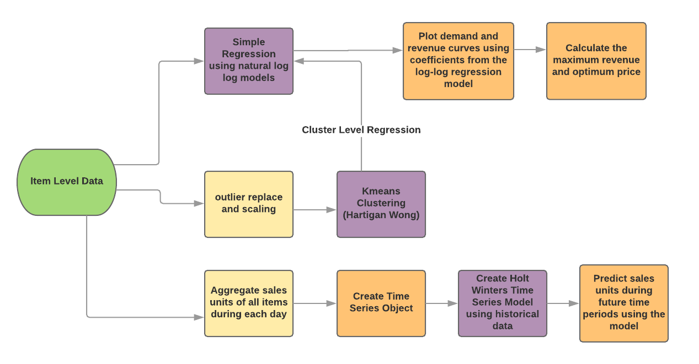

## *Abstract*
   
Pricing is a vast, inter-disciplinary field which borrows from marketing, finance, economics and analytics. I have always been interested in the Pricing field and this paper builds on my previous unpublished work. The Four Ps of marketing - Product, Price, Promotion and Place - are the foundation of any transaction. The Price is a crucial driver especially in a B2C (Business to Consumer) relationship as the Price is what nails the buying decision as there is no room for a consumer to negotiate. Pricing being inter-disciplinary uses the principles of marketing, the principal ratios of finance, the quantitative rigor of analytics and the data structures of computer science. I looked at applying this multi-disciplinary approach for pricing in the consumer retail industry. Through an analysis of the transactional data set (created by Chen, Sain & Guo in 2012) which contains all the transactions occurring between 01/12/2010 and 09/12/2011 for a UK-based and registered non-store online retail, I computed the elasticity of the products sold using the log-log model and implemented the model using regression. I also logically grouped products using the K-means clustering algorithm to improve estimations. This will help us understand the price sensitivity of the items/logical item groups and thereby maximize revenue. I also built a Holt Winters time series model to know the high-level demand variation using aggregate units of all items during each day. This helps in forecasting - understanding the trend of sales units. Maximizing revenue or sales dollars is one of the primary goals of business as it will directly impact the bottom line.
  
**Keywords**: Marketing, retail, price, elasticity, regression, log-log, clustering, revenue, Holt Winters

